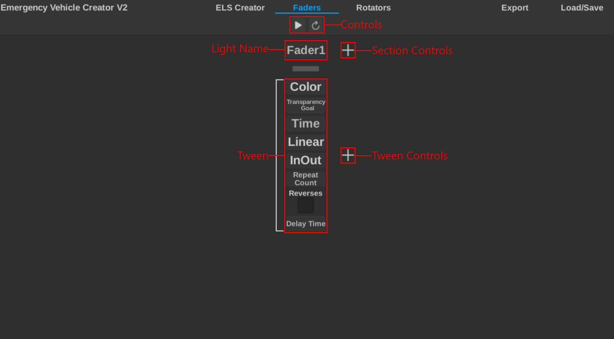
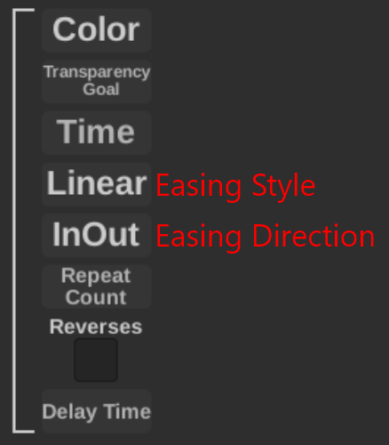

---
  authors:
    - parker02311
---

## Overview

The faders tab is where you can create custom faders for your vehicle. Faders are lights that fade in and out 
instead of just suddenly appearing. This tab is a bit more complex than the ELS tab but it is still quite simple.
Here is a breakdown of the faders tab:

There is a lot going on there, so lets get a brief overview of each label.

=== "Controls"
	These are controls for the entire screen. These controls tend to reappear throughout the plugin.

	- **Play/Pause**: This button plays or pauses the pattern playback. You can also use `p`.
	- **Reset**: This resets the screen to the default state.

=== "Light Name"
	The light name is well, the name of the light inside the lightbar. This textbox will also dissapear and show the
	current light color when playing back your pattern.

=== "Section Controls"
	The faders screen is devided into sections, this allows for more organization.
	These controls allow you to add or remove sections.
	Adding or removing depends on the current sections position.

=== "Tween"
	We will go over this below.

=== "Tween Controls"
	These controls allow you to add and remove tweens.
	Tweens are the actual faders that you create.

## Terminology

A lot of the terminology used in the faders tab is the same as the ELS tab. Here is a quick overview of the other terms used:

- **Section**: Faders sections are different. Each section is one light.
- **Fader**: Another name for a section.
- **Tween**: A tween is a frame of the section. It controls the fade in and fade out of the light.

---

## Understanding Tweens

Tweens are similar to rows in the ELS tab. They are the individual frames of the fader. Each tween controls the fade in and fade out of the light.

Tweens are literally just Roblox tweens. You can also look at the Roblox tweening documentation for better information.
You can find the Roblox tweening documentation [here](https://create.roblox.com/docs/reference/engine/datatypes/TweenInfo).

- **Color**: This is the color of the light.
- **Transparency Goal**: This is where the transparency will end up at the end of the tween.
- **Time**: This is how long the tween will take to complete.
- **Easing Style (Linear)**: This is the easing style of the tween. You can change this to make the tween smoother or more abrupt.
- **Easing Direction (InOut)**: This is the easing direction of the tween. You can change this to change how the easing style is applied.
- **Repeat**: This is how many times the tween will repeat. 
- **Reverses**: This is if the tween will reverse after it completes.
- **Delay**: This is how long the tween will wait before starting.

---

## Creating a Fader

Creating a fader is quite simple. Here is a step by step guide on how to create a fader:

1. Change the color of the light.
2. Set the transparency goal to the desired transparency, usually around 0.
3. Set the time to how long you want the fade to take.
4. Set the easing style and direction to your liking.
5. Set the repeat and reverse to your liking.
6. It is commong to leave repeat, reverse, and delay at 0. Try experimenting with them when you are ready.

---

## Next Steps

If you would like to export the pattern onto a vehicle, check out the [Exporting a Pattern](./exporting.md) guide.